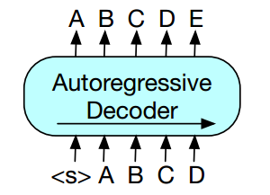
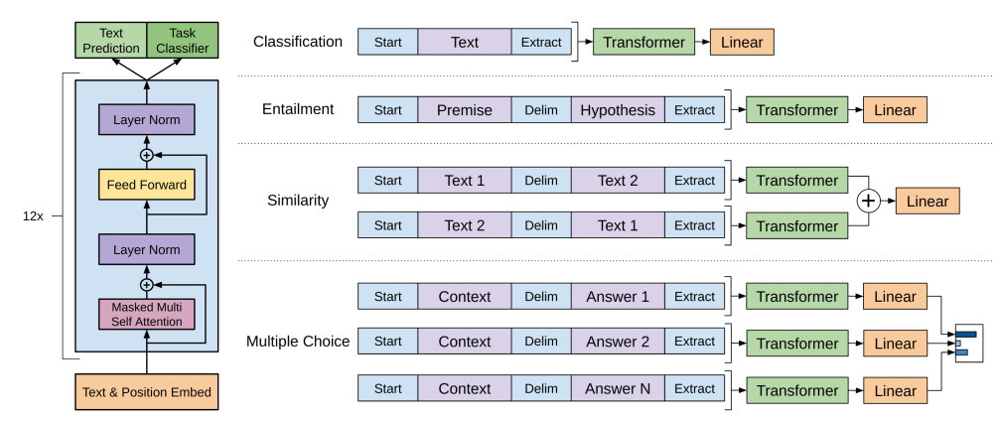
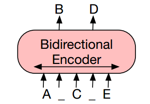
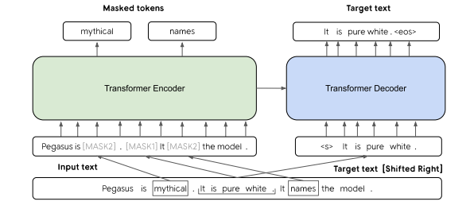

Recently in the last 3 to 4 years since the release of the research paper "Attention is all you need" [1] which showed
the use of purly attention based deep learning architecture for achieving new SOTA results for Machine translation
and a better parallelizable model for GPUs, a lot of research has been conducted on this architecture and how it works. Many different variants of the original transformer
model has been proposed to solve variety of different tasks in NLP and other sequence based tasks. Because of the sheer number of variants and research done on the use of transformers,
it may become quite difficult to survey the research papers on transformers and their varients.

**To simplify our understanding in the research around transformers it may be useful to categorize the research into several kinds such as:**
1. **Unsupervised-pretraining strategies:** Research to improve performance of the transformer models by experimenting with different innovative pre-training strategies and best ways to train transformers in unsupervised manner
2. **Improving efficiency:** Studies on how to improve the efficiency of transformers for inference and training
3. **Understanding internal working:** Experiments and research on understanding intricate details on how transformers work under the hood and why self attention works so well
4. **Learning unique downstream tasks:** Experiments with Research around what kind of downstream tasks can be solved using the trained transformer model and how to effectively fine-tune them
5. **Domain Adaptation:** How to adapt the models on variety of different domains of text
6. **Diverse Applications:** Use of transformer architecture on different types of application from Text, Audio, Images, etc

One of the most important area of research has been the first point mentioned above concerning how to perform unsupervised pre-training effectively.

In this article we will go through some popular and important research done in this area and see how they shaped the current state of the art
in the field.

# What is Pre-training a transformer model?
The highly cited research paper BERT (Bidirectional Encoder Representation from Transformers)[2] and GPT by open AI were among the first to introduce innovative ways of pre-training the transformer model architecture.
Here, pre-training meant training the model **in unsupervised manner** using **huge amount of untagged free form textual data** in the hope that the training will result in model parameters learning
some inherent properties of the text or "understand" the text and language in some shape or form. If the model gains some kind of intuition on how text is written, it will then
be easier for the model to be further adjusted (fine-tuned) to perform more defined tasks on text like classification which can be trained using small amount of supervised data.

Since, creation of tagged data for supervised learning is difficult and cumbursome it would be useful if the pre-training prepares the transformer model well to be modified easily to solve
myriad tasks. Much of the research has revolved around creating better and more effective approaches to pre-train to make supervised training more performative and efficient.
In this article we will get a brief overview of these research techniques.

# Different pre-training methods
Lets take a dive into different pre-training methods that has been proposed and in use today. We will analyze how these pre-training approches
were founded, what do they mean, what are their pros and cons, in which situations they have shown to be good and so on.

- ## Autoregressive Language Modelling:
  Introduced in GPT-1 paper, this pre-training technique is the first technique which was used to perform unsupervised training on transformer architecture.
  
  The training goal of this technique is simple - model is trained to predict next tokens or words by looking words or tokens coming before. For example, given as input a sentence, 
  "Harry likes to play basketball. He practices it", the model is tasked to predict high probable next word. A proparly trained model should give high probability to next word like "daily" or
  often instead of unlikely words like "slowly" which would not make that much sense. So, the idea is to train model in such a way that it is able to predict high probability next words given
  previous input. A good model will thus likely start to learn the properties of the language like learn correct grammatical structures, responding to previous text context, learn correlated words,
  and so on. The concept could be well summarized using **Fig 1** below where A, B, C.. represent tokens and the goal of the model is to predict unseen E given previous tokens.
  The model is called autoregressive because it predicts future values based on what it sees in the past.

  |  |
  | *Fig 1. Autoregressive Language model working. Image source: BART PAPER [4]* |
  
  Using this approach helps in training of transformer models which can be further tuned on specialized downstream NLP tasks. Fig 2 shows how trained GPT model could be used to further fine-tune
  other tasks like classification, Entailment etc by providing appropriately formated text as input to transformer model and feeding the output from transformer model into Linear layers
  to perform necessary tasks.
  The research papers following GPT 1, including GPT2 and
  GPT 3 follows the similar approach but with improved changes upon original.

  |  |
  | *Fig 2. Fine-tuning GPT Image source: GPT PAPER [3]* |

  #### Advantages

  Since this technique utilizes the natural sequential flow of a language where next words and sentences are dependent on what has come previously, the model which gets trained
  learns a good representation of how text is generated. It has been empirically found that such kind of pretraining is especially well suited for real world applications which require text generation like
  automatic story writing given a topic, writing assistant, sentence completion, code completion/assist etc.

  Since, this pre-training technique tends to lean the intuitive nature of language, it can also be used for other applications like text classification, token classification, or any application,
  which requires learning from a sequence of tokens.

  #### Limitations
  
  Even though this training mechanism is very natural because it immitates the natural way of writing/using a language from left to right (in one direction), it has a major limitation.
  In this approach, the model is trained to only look at previous context while trying to make any kind of prediction. But, in many situations only knowing previous context is not that
  powerful compared to knowing the full context past and future. For instance, if we want to figure out what word would best fit in a location in a paragraph, it would be better if we consider
  both before and after context of that location.

  For, example, In this sentence : "The man went to the \<blank> to buy groceries", if we want to predict correctly what should come at the \<blank>
  location, taking into consideration both words before \<blank> and after it would be far easier compared to just considering words before it. But unfortunately in this type of pre-training
  only past context is considered. To mitigate this issue other types of pre-training approaches have materialized.

- ## Masked Language Modelling(MLM)/Token masking:
  The other most popular and now ubiquitously found pre-training techniques are called as Masked Language modelling or token masking approaches.
  Unlike the autoregressive approach these approaches takes into account both the previous context and future context into consideration to generate token embeddings and are thus 
  thus bidirectional in nature. Thus each token has an embedding/representation that is dependent on both future and past context resulting in more representational power in the embeddings generated.
  These pre-training strategies 
  
  |  |
  | *Fig 3. Bidirectional Language model. Image source: BART PAPER[4]* |

  In Fig 3, the intermediate tokens (randomly masked tokens) are trained to be predicted given past and future tokens.

  This is one the approaches utilized in BERT paper. Bidirectional attention proved to be especially useful and more powerful than only unidirectional approaches for applications like
  text classification, Named Entity detection, token classification, sentence classification etc because the embeddings exploited larger context compared to autoregressive LM.

  Apart from BERT, other prominent variants which employs this technique in principle include Roberta, Albert, Electra, SpanBERT, DistilBERT etc. Although there are many differences between these 
  variants but the underlying principle followed is based on Masked Language modelling.

  There are some sub variants in MLM with slightly different ideas on what constitute a token or how to apply mask. For example, In SpanBERT instead of masking individual tokens contiguous
  sequence of tokens are masked instead which ends up producing better results in many cases compared to basic MLM used in BERT.

  #### Advantages
  - The obvious pro is application of more context to train and make prediction, thus more powerful token embeddings.
  - It is also quite easier and intuitive to create a lot of training data from a large corpus of text. There can be large number of ways in which we can randomly mask tokens by controlling
    the percentage of masking, type of masking (masking individual words vs contiguous groups), detecting random deleted masked tokens and so on.
    Such modified masking schemes could be easily experimented either individually or can complement each other.

  #### Limitations
  - Since, in MLM bidirectional context is required, it is not suited well for naturally autoregressive tasks directly like text generation.
  - Because MLM is token based, the masking window is generally kept small (not more than handful of tokens masked). This may bias the model to focus more on mostly
    nearby words while generating embedding for each word. This might be insufficient when we want to deal with sentence level or paragraph level granularity instead of word level.

- ## Sentence Level prediction:
  In the previous section we saw how MLM is very useful and has become popular. But, it may have limitation when we want to the model to more focus on sentence structure and paragraph
  structure rather than small window of word structure.
  
  To mitigate this, some pre-training objectives have been experimented with that involves more granularity.
  - **Next Sentence Prediction(NSP)**: Next sentence predition was first proposed in BERT paper where the in addition to MLM NSP is also used for pre-training.
  The goal of NSP was to predict if any two sentences are consecutive or not (ie predict true if one can come after another or false). It was a hope that 
  such type of pretraining objective would better help in getting a sentence representation which could be used for better fine-tuning sentence/text classification task.

  - **Sentence Order Prediction**: But, in later research papers it was proved that NSP is not contributing much producing better pre-trained model but might also be detrimental. In AlBERT[5] paper a slightly different version
  of NSP was used which proved helpful. Here, the objective is called "Sentence Order prediction" where the task was not just to predict true when consecutiveness
  is possible but to predict false when sentences are wrongly ordered. This resulted in better model training as **Sentence Coherence objective** was learned which proved to be stronger objective in combination
  with MLM.

  - **Gap Sentences Generation (GSG)**: In PEGASUS[6] research paper, it was also found that MLM is not best suited for models which needs to be designed specificlly for abstractive summarization.
  In this paper GSG suited better, the goal of which was to mask whole sentences from documents using pre-defined heuristics and then make the model generate the concatenated masks sentences
  given the whole document. Unlike NSP and SOP this pre-training technique required both encoder as well as decoder unlike BERT and AlBERT which comprised only of Encoder. Decoder is required
  because generative capabilities are also required.

    Fig below, demonstrates the GSG and MLM pretraining objective applied together.

  |  |
  | *Fig 4. GSG and MLM pretraining together: Pegasus PAPER* |

  
- ## Other customized pre-training objectives:
  Apart from the ones mentioned above there are other pre-training strategies which might work better or not depending upon the circumstances and type of data availability.
  Many these strategies revolve around the concept of how making the model learn how **language works by making it denoise the artificial input noise**. Many such techniques
  are compared in BART[4] paper.
  - Other Text Corruption strategies:
    - Token Deletion: Randomly delete tokens in the input text forcing the model to not only predict missing tokens as in MLM but also detecting where they are deleted
    - Text Infilling: A number of text spans are sampled from a distribution and replaced with single [MASK]. Thus, this results in model being taught to how many tokens
    are missing from span as well.
    - Document Rotation: A token is chosen uniformly at random, and the document is rotated so that it begins with the token. This task trains the model to identify the start of the
    document.
  - Many techniques try to improve unsupervised pre-training by making it more efficient to train like [7] paper tries to make BERT training easier for extremely rear words
  by storing the rear words in a dictionary and re-using their embeddings whenever a new mention of rare word occurs and it does not have enough useful context around it.
  Electra [8] also tries to improve the training efficiency of pre-training by making it more sample efficient using replaced-token detection instead of predicting the token itself.
  Instead of masking the input, our approach corrupts it by replacing some tokens with plausible alternatives sampled from a small generator network.
  - Another way could be to use some kind of better heuristic to choose which tokens to mask. [9] utilizes external resource to decide which spans to mask.

# Final thoughts
Since pre-training objective can be an integral part in performance of the transformer model on downstream tasks, it is important to have knowledge about different kinds of
techniques so that if there is a need to train a custom model we can have a way to think intuitively about different approaches and not stick to only one or two existing approaches.
Maybe a different approach might prove to be superior for a customized problem.

## Reference
1. [Attention Is All You Need](https://arxiv.org/pdf/1706.03762.pdf)
2. [BERT: Pre-training of Deep Bidirectional Transformers for Language Understanding](https://arxiv.org/pdf/1810.04805.pdf)
3. [Improving Language Understanding by Generative Pre-Training](https://s3-us-west-2.amazonaws.com/openai-assets/research-covers/language-unsupervised/language_understanding_paper.pdf)
4. [BART](https://arxiv.org/pdf/1910.13461.pdf)
5. [ALBERT: A LITE BERT FOR SELF-SUPERVISED LEARNING OF LANGUAGE REPRESENTATIONS](https://arxiv.org/pdf/1909.11942.pdf)
6. [PEGASUS: Pre-training with Extracted Gap-sentences for Abstractive Summarization](https://arxiv.org/pdf/1912.08777.pdf)
7. [TAKING NOTES ON THE FLY HELPS LANGUAGE PRE-TRAINING](https://arxiv.org/pdf/2008.01466.pdf)
8. [ELECTRA: PRE-TRAINING TEXT ENCODERS AS DISCRIMINATORS RATHER THAN GENERATORS](https://arxiv.org/pdf/2003.10555.pdf)
9. [Span Selection Pre-training for Question Answering](https://arxiv.org/pdf/1909.04120.pdf)