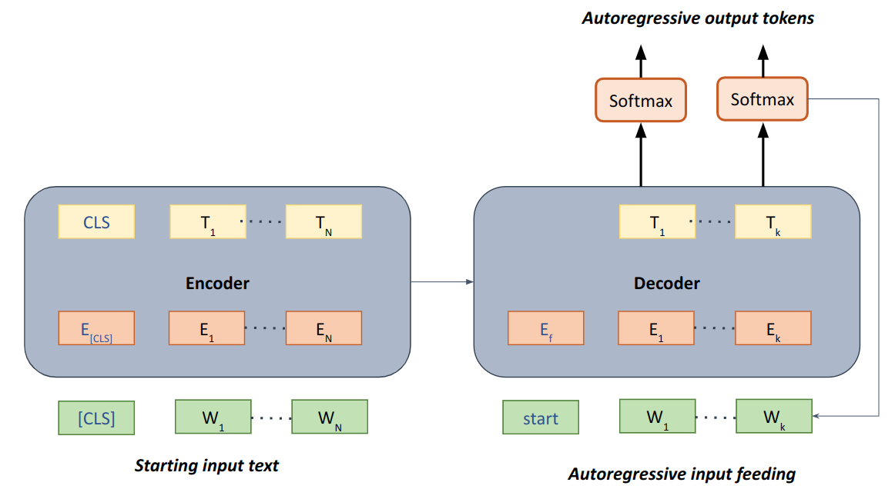

One of the major reasons for the popularity of transformer models is their ability to be
fine-tuned effectively on myriad downstream NLP tasks achieving great performance. The unsupervised
pre-training strategies helped the transformer model to gain intuition and understanding around how
language and text work, which in turn facilitates easier fine-tuning using relatively less amount of
supervised data for downstream NLP tasks.

In this post, we will look at a variety of downstream NLP tasks which we can exploit using transformer
based models and briefly touch upon how they're trained.

# Popular NLP tasks
There are many types of NLP tasks which can be useful in solving real world problems. We can broadly
categorize the tasks into:
1. Text classification
2. Token classification
3. Text generation
4. Information Extraction
5. Similarity prediction

Let's take a look into each category and their subcategories in more detail.

## Text classification
Text classification is the most basic task which is useful in many real world applications.
It can be defined as classifying text (sentence/paragraph/document) into a set of
**pre-defined classes**. The classification could be multi-class classification where multiple classes
are present, but each text can belong to only one of the classes, and it could be multi-label classification
where a text could belong to multiple classes. The important point in classification is that the classes
are pre-defined.

### Real world Examples
- **Sentiment Analysis** : It refers to predicting the sentiment of a text, whether the sentiment is positive
    or negative turning it into a binary classification problem.
    Useful in scenarios to assess sentiment of customers like in movie or product reviews, service review,
    Social media and news comments etc.
- **Topic detection** : Could be a multi-class or multi-label problem, for example, to help in tagging
    topics in social media posts, forums, research papers like in Quora, Stackoverflow, reddit, arxiv etc.
    Or in detecting Intent of what is requested for a chatbot.
- **Sequential sentence classification** : Similar to topic detection, but instead of predicting one topic 
    independently for single input text, multiple topics are predicted
    for a sequence of text. For example, with research paper abstract as input predicting which sentences
    are part of introduction, which sentences shows procedure and which sentences give results. Another
    example is given a document automatically classify important sentences inside that document.

### How it works
Fine-tuning text classification generally involves feeding complete input text into the transformer model and
pooling/aggregating the transformer output in some way before forwarding the output to feed forward layers which can
perform classification. The input text may also contain special tokens if necessary to provide special meaning to
some parts of the text, like assigning a special token after every sentence in a paragraph. The below diagram summarizes
the same approach where input sentence is fed and embeddings for the whole input sentence is extracted and aggregated
from the first [CLS] special token.

|  |
| *Fig 1. Fine-tuning text classification* |

## Token classification
In token classification, as the name suggests, instead of classifying multiple set of words/tokens as in text classification,
the task is to classify each token separately. Otherwise, the concept of classification remains the same. There are
many popular subtypes this task can encompass.

### Real world Examples
- **Named Entity Recognition** : In this task, Entities can be comprised of multiple tokens and the job of the classification
    task is to identify whether the correct tokens are entities and what type of entities they are. For example,
    in a sentence entities could refer to Names of people, organisations, Place, name of medicine, name of disease etc.
    It is the job of the algorithm, given an input sentence, predict the entities of interest present in that sentence
    correctly. This could be useful in applications like identifying what places were mentioned in text, data mining
    applications to analyze important entities were mentioned and in which context they were used, for example, finding
    symptoms in Electronic medical record.
- **POS tagging** : This task assigns part of speech tag to each of the words. This might help in further assessment of written
    text to, for example, checking grammatical mistakes or spelling mistakes.
- **Phrase detection** : Refers to detecting phrases(set of tokens) of interest into specific pre-defined classes
    or just classifying whether the phrases are important or not considering the context. For example, detecting
    important phrases in a text might help in applications like assisted fast reading, automatic highlighting,
    summarizing a document with important words or for improving and speeding further document classification task.

The output of token classification algorithms often acts as important inputs to more sophisticated algorithms like
in a chatbot.

### How it works
Fine-tuning works similar to text classification, where input is the text containing the tokens which need to be
classified, but instead of pooling/aggregating whole text embeddings, classification head is applied to each token
separately. An example of how it looks like can be seen below:

|  |
| *Fig 2. Fine-tuning token classification* |

## Text generation
The text generation task can be any task which requires **generating** new text given text the model has seen so far.
Here, generating means, producing new text which may/may not be present in the input text. The newly generated
text should be analogous in some way to the input text. This is in contrast to classification approaches mentioned
above which didn't require generative capabilities. There exist many such text generation tasks as explained below.

### Real world Examples
- **Next word/s prediction** : This type of task's goal is to predict automatically relevant next
    words given previous words. For example, in applications like Autocomplete feature for fast typing, assisted searching, writing and
    grammar assistance, automated reply in chatbots etc.
- **Text rephrasing** : Since the model is capable of generating new words or sentences, it can also be used for
    applications like automated sentence rephrasing assistance, grammatical error correction, Questions creation
    from a text.
- **Text summarization** : Summarization of large documents to small summaries in an abstractive way will need both identifying
    and rephrasing important information in an appropriate grammatical manner. This can only be done using model text
    generation capabilities.
### How it works
Unlike the classification approaches which could be solved using only the encoder portion of transformer architecture,
the generative task generally requires either a decoder alone or both encoder and decoder. Some autoregressive
mechanism is required for the generative task as generating new words/tokens always need information about what was
predicted by the model itself in previous time steps. A general outline of how generative tasks would work and
fine-tuned can be seen in the diagram below. A decoder only architecture could also work in this case, but adding an
encoder helps in adding bidirectional context for text generation.

|  |
| *Fig 3. Fine-tuning Text generation* |

In this case, instead of using only encoder both encoder and decoder is required, encoder for encoding the input text
and learning representation from it and then forwarding that representation to decoder to output tokens in autoregressive
manner where the tokens predicted are fed back into decoder to predict further new tokens until the end token is reached.

## Information Extraction
Any task which would help in extracting/pinpointing relevant information from a document given a query can be
regarded as an information extraction problem. Information extraction can be solved using either transforming the
problem to classification task or text generation task. The difference from types of tasks is that here, instead of
just providing input text to act upon, the model is provided the both input text and a query
to find that information in the input text. Popular information extraction tasks include:

### Examples
- **Extractive Question Answering** : Given a text/para and a question as input, the model predicts start and end
    positions of the correct answer if present. This could be helpful in applications like searching facts and Answering
    FAQ'S.
- **Abstractive Question Answering** : Similar to Extractive Question answering but instead of finding locations of answers, 
    the answer needs to be generative using generative modelling because either exact extractive answer might not be
    present or rephrased answer is more suitable.
- **Information retrieval** : This is similar to Extractive Question Answering the text where information is to be
    searched is very large and cannot fit in model parameters. Thus, information retrieval is the task of finding locations
    or paragraphs where the answer to the input query is liable to find. This information can be input into extractive
    question answering pipeline.

### How it works
Its working is almost the same as classification model. For example, extractive question answering can be solved by
token classification shown in fig 2, where each token is classified whether it is a start or end token of correct answer. The tokens
having the highest probabilities will be chosen as answers. Similarly, for abstractive question answering, first the
input text and question would be input into the encoder, and the decoder would be used autoregressively to predict
the generated answer similar to the text generation model shown in fig 3.

## Embedding generation and Similarity prediction
In all the above tasks discussed, the prediction by a model happens immediately after it receives the necessary
input. This type of prediction is very well suited for many applications but can be extremely slow when we want to perform
a very large number of predictions in a brief time. Suppose, we want to run a K nearest neighbour algorithm
on corpus having 100,000 documents. By following above approaches, given an input document, we first will have to generate
embedding of the input document and then generate embeddings for each of the 100,000 documents and compare them each.
This will cause a lot of time for a simple query. So, it makes sense to pre-compute appropriate embeddings, and then
apply K-nearest-neighbour on them. Such types of approaches require algorithms to fine-tune models in such a way that
they're capable of generating effective embeddings which could then be stored and used later.

#### Example tasks
- K-nearest-neighbour : Given a sentence/text/query, generate its embedding and find the K nearest neighbours in a
    database of large number of target texts. It Could be useful in applications like similar documents recommendation,
    duplicate document search, plagiarism detection, Contextual search etc
- Clustering: When a model is capable of generating appropriate embeddings of a text where actual similar texts are close
    to each other following some metric and dissimilar texts, are far away from each other, we can use clustering
    algorithms like K means to cluster documents informatively based on similar topics or relevant
    criterion

### How it works
Fine-tuning of appropriate embedding generation can be done using creating suitable similarity/scoring function, and training
the model by preparing right positive and negative samples. The idea will be to train the model parameters in such a
way that similar items will have higher similarity score and dissimilar items will have very low or negative similarity
scores. Loss functions such as Triplet loss function, contrastive loss function and even simple cross entropy loss
function could be utilized to fine-tune such model.
SentenceBERT is one such example to achieve this.

# Final thoughts
Transformer models can be used to fine-tune many downstream NLP tasks, the reason for which
they've become so popular. The variety of downstream tasks that could be easily trained on top of a pre-trained
Language model has resulted in re-using of same transformer architecture backbone to be utilized to solve many complex
problems.