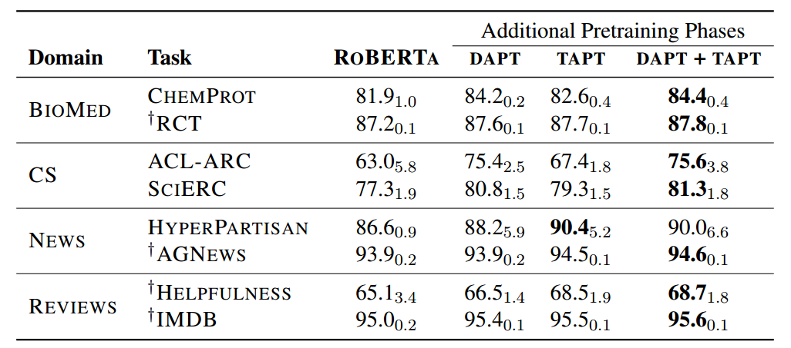
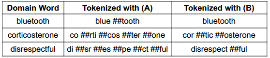

Transformer models have proven to be quite performative and useful when correctly pre-trained on large text corpus 
and fine-tuned with small to moderately sized supervised datasets to solve downstream NLP tasks. Much of the research
in pre-training of Language models, and testing performance is done using general text corpus like Wikipedia, News
articles, Reddit comments and mixture of such types of text corpus sources. The main reason is easier availability 
of such resources and trying to acquire as much text and as varied text as possible for research purposes. So, many
of the popular pre-trained models turned out to be pre-trained using general purpose text which can't necessarily
be categorized as a particular domain.

But in real life and most of the production scenarios, applications are made to handle a particular domain of text
data. For example, application to summarize news articles, application to perform search over scientific research
documents, chatbot built to answer education-related queries, and so on. Thus, these specialized applications focus
on particular domains of their own and, it begs the question, whether using a general purpose trained language
model to train for such specialized domain is the best thing to do. This question led to the research community in
seeking the area of domain adaptation for language models.

In this post, we will understand what domain adaptation is, its benefits and how it can be done.

## What is Domain Adaptation and why it is important?
Domain adaptation can be defined as any training technique which can help a pre-trained Language model to better
adapt itself to solve tasks in a specialized NLP text area.

This can be important because in real world scenarios, there are many NLP domains with common tasks which can benefit if 
the language model is adapted suitably. Some common NLP domains and popular tasks are as given below:
- **Medical and/or Pharmaceutical domain** : Popular tasks and applications in this domain include
  - Entity detection and Linking: Detecting special pharmaceutical and medical entities in a text like entities
    pertaining to diseases, medicine, proteins, symptoms, side effects etc.
  - Specialized chatbots for answering patient queries and return correct search results
  - Research paper recommendation: What research to read next pertaining to research area of interest
  - Extractive text summarization: Automatically highlighting important sentences in medical research papers etc
- **General News domain** :
  - News article summarization
  - Article recommendation based on readers' interest and past history
  - Clustering news articles and finding similar or correlated news
- **Specialized Product sales and services** :
  - Sentiment analysis on reviews of purchased products like retail products or even watched movies or games played
  - Customer support service assistance for faster solution resolution
  - Intelligent IVR systems

Many NLP applications are focused on a particular industry and may also have focused subdomain in that industry,
like in Pharma industry language around clinical trials might be different to drug discovery research and very
different compared to clinical Electronic Medical records language. There could be difference in vocabulary,
sentence structure, short forms, language formality and so on. Thus, in most real world cases, it may become
necessary to specialize a language model to get better performance on unique tasks.

To create such specialized models, one approach is to train the transformer-based language models directly using
relevant domain text data. This has been done on some popular models like **BioMegatron, Sci-Bert, BioBERT** etc, which
were pre-trained directly on specialized text corpus like Pubmed extracts and other scientific journals. But in
most cases for specialized domains, there either would be dearth in the quantity of text necessary to train a full-fledged
language model, or it would be too computationally expensive and time-consuming.

Thus, it becomes prudent that we find useful training methods that could help in adaptation of existing Language models
more efficiently.

## Domain adaptation strategies
Let's review some domain adaptation strategies that we can follow and discuss some research papers
proposing these ideas.

#### Adapting domain by continuing the pre-training using in-domain dataset
  This idea is intelligently introduced in the paper by Gururangan et al. [1] Titled "Don’t Stop Pretraining: Adapt Language Models to Domains and Tasks"
  where they investigated the performance improvement of an existing Language model when **"Domain adaptive pre-training" (DAPT)** is
  performed in high and low-resource setting. They considered four domains — biomedical (BIOMED), computer science (CS), news and reviews
  and adapted the Roberta model.
  **Some of the important observations were:**
  - DAPT improves over Roberta in all domains, especially for BIOMED, CS, and REVIEWS where the target domain is more distant than ROBERTA's
  source domain. Thus, the more unique the target domain, the more useful domain adaptation could be. This includes target
  domain's difference in vocabulary as well as target domain's difference in context and meaning.
  - For very specialized domains, it is sometimes very difficult to even get a large scale untagged text corpus. In such cases, 
  a technique called **"Task adaptive pre-training (TAPT)"** could be applied where pre-training is done on the unlabeled 
  training set itself which is later going to be used for supervised training. The TAPT approach uses a far smaller pre-training
  corpus, but one that is much more task-relevant. TAPT could be done on top of DAPT as well and is especially useful when
  task data is a narrowly defined subset of a broader domain. **Fig 1** from the paper shows the summary of the improvements when 
  DAPT AND TAPT is performed on different datasets and tasks.

  |  |
  | *Fig 1. Different phases of pre-training results. Source: [1]* |

#### Updating tokenization strategy and/or the vocabulary
  Another approach that could be relevant for adapting to a new domain can be adapting to a new vocabulary which is most pertinent
  to the task domain at hand. In the DAPT and TAPT discussed above, the vocabulary was kept the same even though the domain was different.
  For many specialized domains, vocabulary differs significantly compared to vocabulary of general domain. For example,
  consider this example **Fig 2** from paper [2] titled "AVocaDo: Strategy for Adapting Vocabulary to Downstream Domain" where specialized
  domain can include complicated words which won't be tokenized in an efficient and meaningful manner using the general domain
  vocabulary.

  |  |
  | *Fig 2. Special tokenization example Source: [2]* |

  As seen above, the complex word corticosterone is tokenized is much efficient manner and its sub tokens can be more meaningful
  compared to when done using default general domain tokenization.
  The paper [2] showcases strategies for fine-tuning with regularization to adapt and add specialized tokenization which
  could result in better performance of Language models.

  Another tokenization and vocabulary adapting approach is outlined in the paper [3] titled "INDOBERTWEET: A Pretrained Language Model for Indonesian Twitter
  with Effective Domain-Specific Vocabulary Initialization", where they show innovative technique of initializing domain-specific
  vocabulary to improve pretraining from scratch using resource-limited corpus.
  They concluded that using the averaging of subword embeddings is a more effective tokenization-initializing technique for 
  newly formed more holistic tokens in specialized domains which reduces the overhead of domain-adaptive pre-training by 80% compared
  to previously token embeddings initializing methods.

### Final thoughts
Whenever we face situations where we want to use an existing language model to solve a niche task in a particular specialized domain,
we should keep in mind that we can use domain adaptation techniques and tokenization and/or vocabulary adaptation techniques
to improve the performance of the models.

### References
1. [Don’t Stop Pretraining: Adapt Language Models to Domains and Tasks](https://arxiv.org/pdf/2004.10964.pdf)
2. [AVocaDo: Strategy for Adapting Vocabulary to Downstream Domain](https://arxiv.org/pdf/2110.13434.pdf)
3. [INDOBERTWEET: A Pretrained Language Model for Indonesian Twitter with Effective Domain-Specific Vocabulary Initialization](https://arxiv.org/pdf/2109.04607.pdf)
