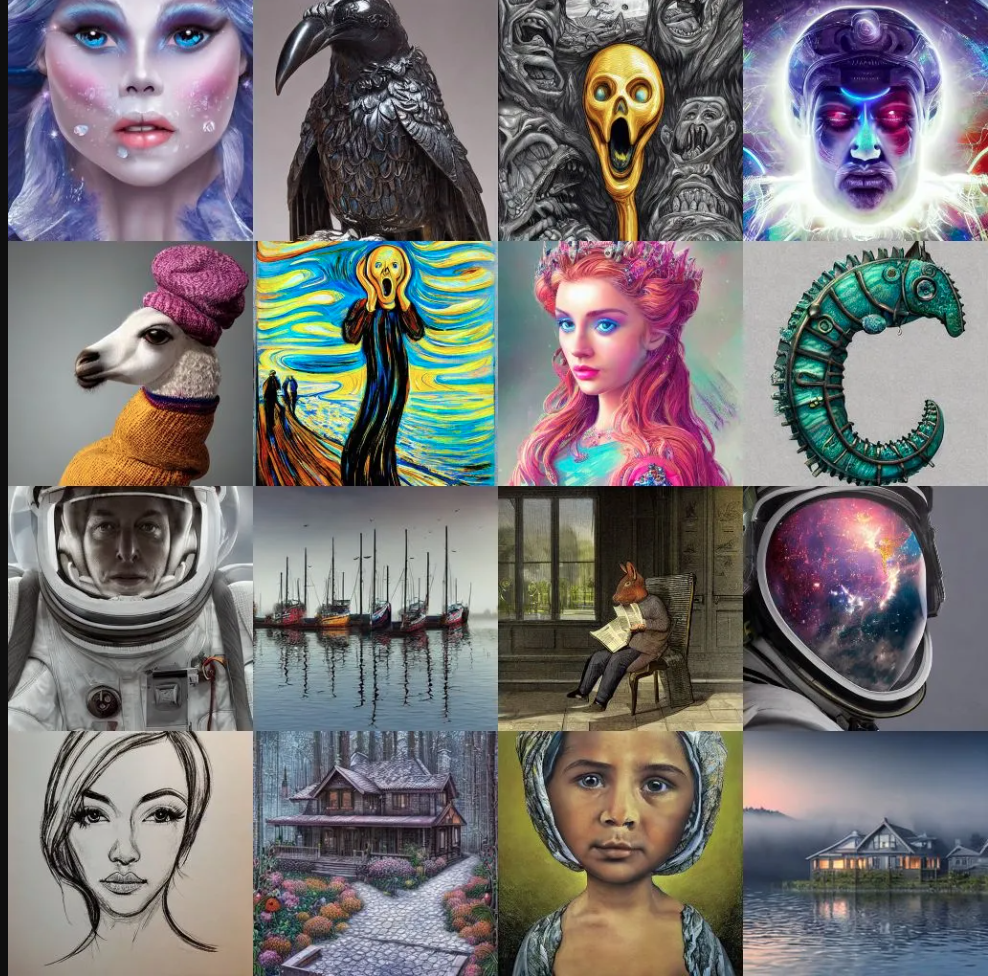
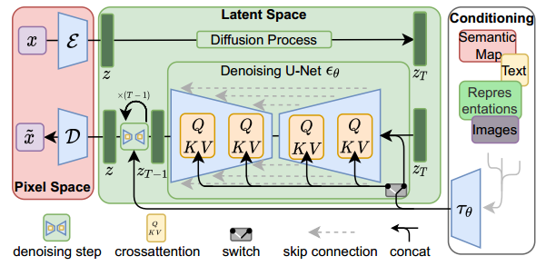

Generative AI has been predominantly talked about in the media and social media in 2022 and 2023 especially since its
capabilities have been shown publicly by OpenAI's DALL-E 2 and Stable Diffusion models by Stability AI. The impressive
capability to generate beautiful looking images like in figure below has mesmerised us on the innovative potential of
Deep Learning models and AI in general. Being Data Scientists, our curiosity extends beyond just using the models and
playing around with it. Understanding these models in detail will help us to appreciate properly the power of these models,
how might we improve upon them, what are their limitations, and make informed use of them.

Thus, in this blogpost we will go a little bit deeper into understanding such models and their components. We will
especially look into Stable diffusion model open sourced by StabilityAI which can convert textual prompts into images and use the wonderful Huggingface Library
"Diffusers" to navigate its working.

Thus, we will look into:
- How to load a pre-trained diffusion model and pipeline
- Perform a simple inference using the pipeline
- Understand basic mechanism behind how training and inference in Latent diffusion model works
- Check out individual components and models inside this stable diffusion pipeline

|  Samples generated using Generative models|
| *Source: [https://creator.nightcafe.studio/stable-diffusion-image-generator](https://creator.nightcafe.studio/stable-diffusion-image-generator)* |

### Setup
To try the code snippets on your own you can either use colab or your own environment but will need to prepare your system
to run PyTorch code with Huggingface Deffusers library. The installation instructions are provided [here](https://huggingface.co/docs/diffusers/installation).

### Loading a pipeline with pre-trained models
In huggingface Deffusers library, pipeline refers to a class which has methods to load all the components required
to run inference on that particular diffusion model. In below snippet we are loading **stable-diffusion-2-1** pipeline
from **stabilityai** which will download the models if not already downloaded and cached.
```
from diffusers import StableDiffusionPipeline
repo_id = "stabilityai/stable-diffusion-2-1"
pipe = StableDiffusionPipeline.from_pretrained(repo_id, torch_dtype=torch.float16)
```
We are loading a variant model having half precision weights only to save memory and time when working with these models.
If we ```pipe.config``` we get the output:
```
FrozenDict([('vae', ('diffusers', 'AutoencoderKL')),
            ('text_encoder', ('transformers', 'CLIPTextModel')),
            ('tokenizer', ('transformers', 'CLIPTokenizer')),
            ('unet', ('diffusers', 'UNet2DConditionModel')),
            ('scheduler', ('diffusers', 'DDIMScheduler')),
            ('safety_checker', (None, None)),
            ('feature_extractor', ('transformers', 'CLIPImageProcessor')),
            ('requires_safety_checker', False)])
```
As we can see the pipeline loaded many components. Each component fulfills a particular purpose.
- **VAE**: Variational Auto encoder, used to compress the input images into lower dimensional latents which are then
    in turn used for training the model to make diffusion training faster. Its Encoder is used only during training and 
    decoder is used during final step of inference (converting the final denoised image latents to image)
- **Text Encoder**: Transformer model used to convert input text into embeddings which guide what kind of image to be
    generated.
- **Tokenizer**: Tokenizer for Text Encoder
- **Unet**: The Unet model which in this case is a 2D conditional model to support image inputs to be used to predict
    the noise which was added to the image at a particular step.
- **Scheduler**: It has logic to determine what, how and for how many steps noise should be added and predicted noise
    should be removed. There are many different schedulers existing currently, some more efficient than others.
- **Safety checker**: In this particular case by default no safety_checker was initialized but in general it refers
    to a model which given image features from feature_extractor returns whether the image features are NSFW or not.

We will look into each component in more detail later.

If we run ```pipe.to('cuda')```, we get the output showcasing all the different components that have been loaded into
the gpu.
```
StableDiffusionPipeline {
  "_class_name": "StableDiffusionPipeline",
  "_diffusers_version": "0.14.0",
  "feature_extractor": [
    "transformers",
    "CLIPImageProcessor"
  ],
  "requires_safety_checker": false,
  "safety_checker": [
    null,
    null
  ],
  "scheduler": [
    "diffusers",
    "DDIMScheduler"
  ],
  "text_encoder": [
    "transformers",
    "CLIPTextModel"
  ],
  "tokenizer": [
    "transformers",
    "CLIPTokenizer"
  ],
  "unet": [
    "diffusers",
    "UNet2DConditionModel"
  ],
  "vae": [
    "diffusers",
    "AutoencoderKL"
  ]
}
```
### Performing simple inference call
The pipeline mechanism allows us to generate images using just a few lines of code. Let's generate a single image.
```
import torch
generator = torch.Generator('cuda').manual_seed(5)
prompt = 'A cute cat wearing a military cap'
%time image = pipe(prompt, generator=generator, width=720, height=720, num_inference_steps=50)
```
Here, generator was used to seed the image generation process for reproducible results and, we can specify width and 
height of image if required along with num_inference_steps denoising steps to take to generate this image. Keep in mind
that the image generation won't work well with low resolution images like below 512 as the original model was trained
using high resolution images like 768X768 pixels.
The output got is the image:

### Inference and training mechanism
To understand in detail how the training is done and inference is done, we can refer to the paper 
[High-Resolution Image Synthesis with Latent Diffusion Models](https://arxiv.org/abs/2112.10752). Below is the architecture
of the model as mentioned in the paper.

| Training and inference architecture|
|Source: [High-Resolution Image Synthesis with Latent Diffusion Models](https://arxiv.org/abs/2112.10752)|

As seen in the image above a latent diffusion model has three main components, A Variational autoencoder with encoder and
decoder to convert image to latent space and vice versa as remarked as **Pixel Space**, A Denoising U-Net model which 
works in the latent space, and conditioning encoder to help encode conditioning embedding into the Denoising deffuion
model.

**Inference Phase**: The steps during inference phase are:
1. A random noise is sampled from a distribution which was used during the training phase for timestep T (num_inference_steps)
2. The condition (in our case text) is tokenized and fed into text encoding model to get the text embeddings
3. The generated random noise can be interpreted a noisy image Latent. 
4. The noisy image Latent is added as input to the Denoising U-Net for step T-1 along with embedding of condition
    using cross attention mechanism
5. The Denoising U-Net model predicts the noise present for that step
6. The predicted noise is subtracted from the noisy image latent from previous step
7. The noisy image after subtraction represents a new less noisy image latent
8. The steps from 4 to 7 are repeated until T reaches zero
9. At latent embedding generated at step zero is fed through the VAE decoder resulting in the generated image

**Training Phase**:
1. Train an autoencoder model or use a good pre-trained one
2. Train or use pre-trained Conditioning encoder (In stable diffusion case [CLIP](https://openai.com/research/clip) was used)
3. Encode an image to lower latent dimension using encoder of VAE
4. Use diffusion process to add noise onto the latent image for each diffusion step
5. Using the noise that was added as ground truth and text embedding with cross attention as output train the De-noising
    diffusion model to predict added noise correctly
6. Repeat from step 3 to step 5 until convergence or generated images start looking adequate when image latent embeddings
    are decoded back to pixelated images

### Individual components and their working in detail
Now that we know the gist of different components used in the stable diffusion pipeline and how the inference and
training is done. Let's take a closer look into its components.
- #### Variational Autoencoder (VAE)
  The VAE has both encoder and decoder, encoder converting data from image space to lower dimensional latent embedding,
    and decoder converting lower dimensional latent embedding of image back to image space. The encoder is only used
    during the training stage when input images are required to be fed to the diffusion model, while during the inference stage (of text to image)
    only decoder is required to generate images as only text input is given which is not handled by the VAE encoder.
    Let's try to use the vae encoder and decoder on the cute cat image generated and see if the VAE can be used as
    a standalone component.
    ```
  from torchvision.transforms import Compose, ToTensor, Normalize
  # transform to convert pil image to normalized tensor
  transforms = Compose([ToTensor(), Normalize([0.5], [0.5])])
  input_image = transforms(image)
  input_image = input_image.unsqueeze(dim=0)
  cat_image = input_image.to('cuda')
    cat_image = cat_image.to(torch.float16)
    with torch.no_grad():
        encoded_output = pipe.vae.encode(cat_image).latent_dist.sample()
        print(encoded_output.shape)
  ```
  The encoded image embedding shape is:
    ```
    torch.Size([1, 4, 64, 64])
    ```
    which is very less compared to the original image in pixel space. And this is the encoded_image embedding that is worked
    upon by the UNET instead making the Latent diffusion process much faster.
    
    Now lets try to get back the ```encoded_output``` back to pixel space using the decoder and see if we get the same input
    image.
    ```
    def numpy_to_pil(images):
            """
            Convert a numpy image or a batch of images to a PIL image.
            """
            if images.ndim == 3:
                images = images[None, ...]
            images = (images * 255).round().astype("uint8")
            if images.shape[-1] == 1:
                # special case for grayscale (single channel) images
                pil_images = [Image.fromarray(image.squeeze(), mode="L") for image in images]
            else:
                pil_images = [Image.fromarray(image) for image in images]
            return pil_images
            
     with torch.no_grad():
            generated_image = pipe.vae.decode(encoded_output).sample
        print(generated_image.shape)
        # code to denormalize the generated image
        generated_image = (generated_image / 2 + 0.5).clamp(0, 1)
        generated_image = generated_image.cpu().permute(0, 2, 3, 1).float().numpy()
        decoded_image = numpy_to_pil(generated_image)
        decoded_image[0].show()
    ```
    We get the generated image tensor back as  ```torch.Size([1, 3, 512, 512])``` and get the almost exact looking image as shown below
    even though this is a newly generated image with slightly different tensor values.
    
    In this way we know that the variational autoencoder as an individual component works very well.
    Let's see what the architecture of the whole VAE looks like by running the command:
    ```
    from torchinfo import summary
    summary(pipe.vae, input_data=input_image, col_names=['input_size', 'output_size', 'num_params'], depth=4)
    ```
    ```=============================================================================================================================
    Layer (type:depth-idx)                             Input Shape               Output Shape              Param #
    =============================================================================================================================
    AutoencoderKL                                      [1, 3, 512, 512]          [1, 3, 512, 512]          --
    ├─Encoder: 1-1                                     [1, 3, 512, 512]          [1, 8, 64, 64]            --
    │    └─Conv2d: 2-1                                 [1, 3, 512, 512]          [1, 128, 512, 512]        3,584
    │    └─ModuleList: 2-2                             --                        --                        --
    │    │    └─DownEncoderBlock2D: 3-1                [1, 128, 512, 512]        [1, 128, 256, 256]        --
    │    │    │    └─ModuleList: 4-1                   --                        --                        591,360
    │    │    │    └─ModuleList: 4-2                   --                        --                        147,584
    │    │    └─DownEncoderBlock2D: 3-2                [1, 128, 256, 256]        [1, 256, 128, 128]        --
    │    │    │    └─ModuleList: 4-3                   --                        --                        2,100,224
    │    │    │    └─ModuleList: 4-4                   --                        --                        590,080
    │    │    └─DownEncoderBlock2D: 3-3                [1, 256, 128, 128]        [1, 512, 64, 64]          --
    │    │    │    └─ModuleList: 4-5                   --                        --                        8,394,752
    │    │    │    └─ModuleList: 4-6                   --                        --                        2,359,808
    │    │    └─DownEncoderBlock2D: 3-4                [1, 512, 64, 64]          [1, 512, 64, 64]          --
    │    │    │    └─ModuleList: 4-7                   --                        --                        9,443,328
    │    └─UNetMidBlock2D: 2-3                         [1, 512, 64, 64]          [1, 512, 64, 64]          --
    │    │    └─ModuleList: 3-7                        --                        --                        (recursive)
    │    │    │    └─ResnetBlock2D: 4-8                [1, 512, 64, 64]          [1, 512, 64, 64]          4,721,664
    │    │    └─ModuleList: 3-6                        --                        --                        --
    │    │    │    └─AttentionBlock: 4-9               [1, 512, 64, 64]          [1, 512, 64, 64]          1,051,648
    │    │    └─ModuleList: 3-7                        --                        --                        (recursive)
    │    │    │    └─ResnetBlock2D: 4-10               [1, 512, 64, 64]          [1, 512, 64, 64]          4,721,664
    │    └─GroupNorm: 2-4                              [1, 512, 64, 64]          [1, 512, 64, 64]          1,024
    │    └─SiLU: 2-5                                   [1, 512, 64, 64]          [1, 512, 64, 64]          --
    │    └─Conv2d: 2-6                                 [1, 512, 64, 64]          [1, 8, 64, 64]            36,872
    ├─Conv2d: 1-2                                      [1, 8, 64, 64]            [1, 8, 64, 64]            72
    ├─Conv2d: 1-3                                      [1, 4, 64, 64]            [1, 4, 64, 64]            20
    ├─Decoder: 1-4                                     [1, 4, 64, 64]            [1, 3, 512, 512]          --
    │    └─Conv2d: 2-7                                 [1, 4, 64, 64]            [1, 512, 64, 64]          18,944
    │    └─UNetMidBlock2D: 2-8                         [1, 512, 64, 64]          [1, 512, 64, 64]          --
    │    │    └─ModuleList: 3-10                       --                        --                        (recursive)
    │    │    │    └─ResnetBlock2D: 4-11               [1, 512, 64, 64]          [1, 512, 64, 64]          4,721,664
    │    │    └─ModuleList: 3-9                        --                        --                        --
    │    │    │    └─AttentionBlock: 4-12              [1, 512, 64, 64]          [1, 512, 64, 64]          1,051,648
    │    │    └─ModuleList: 3-10                       --                        --                        (recursive)
    │    │    │    └─ResnetBlock2D: 4-13               [1, 512, 64, 64]          [1, 512, 64, 64]          4,721,664
    │    └─ModuleList: 2-9                             --                        --                        --
    │    │    └─UpDecoderBlock2D: 3-11                 [1, 512, 64, 64]          [1, 512, 128, 128]        --
    │    │    │    └─ModuleList: 4-14                  --                        --                        14,164,992
    │    │    │    └─ModuleList: 4-15                  --                        --                        2,359,808
    │    │    └─UpDecoderBlock2D: 3-12                 [1, 512, 128, 128]        [1, 512, 256, 256]        --
    │    │    │    └─ModuleList: 4-16                  --                        --                        14,164,992
    │    │    │    └─ModuleList: 4-17                  --                        --                        2,359,808
    │    │    └─UpDecoderBlock2D: 3-13                 [1, 512, 256, 256]        [1, 256, 512, 512]        --
    │    │    │    └─ModuleList: 4-18                  --                        --                        4,265,216
    │    │    │    └─ModuleList: 4-19                  --                        --                        590,080
    │    │    └─UpDecoderBlock2D: 3-14                 [1, 256, 512, 512]        [1, 128, 512, 512]        --
    │    │    │    └─ModuleList: 4-20                  --                        --                        1,067,648
    │    └─GroupNorm: 2-10                             [1, 128, 512, 512]        [1, 128, 512, 512]        256
    │    └─SiLU: 2-11                                  [1, 128, 512, 512]        [1, 128, 512, 512]        --
    │    └─Conv2d: 2-12                                [1, 128, 512, 512]        [1, 3, 512, 512]          3,459
    =============================================================================================================================
    Total params: 83,653,863
    Trainable params: 83,653,863
    Non-trainable params: 0
    Total mult-adds (T): 1.77
    =============================================================================================================================
    Input size (MB): 1.57
    Forward/backward pass size (MB): 6320.10
    Params size (MB): 167.31
    Estimated Total Size (MB): 6488.98
    =============================================================================================================================
    ```
    As you can see from the architecture summary, the encoder and decoder of VAE is composed of downsampling and upsampling
    blocks having a total of more than 83 million parameters.
- #### Text Encoder
    In this stable diffusion model [CLIP](https://openai.com/research/clip) is the text encoder model which is being used to convert input text into embeddings
    which are in turn fed into the Denoising UNet through cross attention mechanism. A pre-trained Text Encoder model is
    required before it can be used for inference or even before training the Denoising Unet.
    
    Let's see how to use this text encoder as an individual component.
    ```
    prompt = 'A cute cat wearing a military cap'
    # first use the tokenizer to tokenize the text
    tokenized_input = pipe.tokenizer(prompt,
                                    padding="max_length",
                    max_length=pipe.tokenizer.model_max_length,
                    truncation=True,
                    return_tensors="pt",)
    # Then feed the tokenized input into the pre-trained text encoder
    device='cuda'
    with torch.no_grad():
        prompt_embeds = pipe.text_encoder(tokenized_input.input_ids.to(device),
                    attention_mask=tokenized_input.attention_mask.to(device))
    print(prompt_embeds)
    print(prompt_embeds[0].shape
    ```
    We get the output showing that the model returns the last hidden state with embedding shape (77, 1024) which will be used
    as input to provide condition to the Denoising UNet model. The dimensions here shows that this particular model can take
    max number of 77 input tokens and each token has embedding of size 1024.
    ```
    BaseModelOutputWithPooling(last_hidden_state=tensor([[[-0.3132, -0.4478, -0.0083,  ...,  0.2544, -0.0328, -0.2959],
             [ 0.1989, -1.6963, -0.8945,  ...,  0.4661, -0.0971, -2.1465],
             [ 0.2866, -1.2178,  0.7192,  ...,  0.2888, -1.3584, -1.8545],
             ...,
             [-0.2416, -0.3135, -0.0061,  ...,  0.1088,  0.2859, -0.1702],
             [-0.2378, -0.3020, -0.0081,  ...,  0.1044,  0.3022, -0.1558],
             [-0.0176,  0.0358,  0.6011,  ...,  1.1230,  0.6147,  1.1191]]],
           device='cuda:0', dtype=torch.float16), pooler_output=tensor([[-0.1115, -0.2644,  0.8809,  ...,  1.1650,  0.7417,  1.3916]],
           device='cuda:0', dtype=torch.float16), hidden_states=None, attentions=None)
    torch.Size([1, 77, 1024])
    ```
    The architecture summary of this text encoder looks like this,
    ```
    summary(pipe.text_encoder, input_data=[tokenized_input.input_ids.to(device), tokenized_input.attention_mask.to(device)],
     col_names=['input_size', 'output_size', 'num_params'])
    ```
    ```==================================================================================================================================
    Layer (type:depth-idx)                                  Input Shape               Output Shape              Param #
    ==================================================================================================================================
    CLIPTextModel                                           [1, 77]                   [1, 1024]                 --
    ├─CLIPTextTransformer: 1-1                              --                        [1, 1024]                 --
    │    └─CLIPTextEmbeddings: 2-1                          --                        [1, 77, 1024]             --
    │    │    └─Embedding: 3-1                              [1, 77]                   [1, 77, 1024]             50,593,792
    │    │    └─Embedding: 3-2                              [1, 77]                   [1, 77, 1024]             78,848
    │    └─CLIPEncoder: 2-2                                 --                        [1, 77, 1024]             --
    │    │    └─ModuleList: 3-3                             --                        --                        289,713,152
    │    └─LayerNorm: 2-3                                   [1, 77, 1024]             [1, 77, 1024]             2,048
    ==================================================================================================================================
    Total params: 340,387,840
    Trainable params: 340,387,840
    Non-trainable params: 0
    Total mult-adds (M): 340.39
    ==================================================================================================================================
    Input size (MB): 0.00
    Forward/backward pass size (MB): 80.74
    Params size (MB): 680.78
    Estimated Total Size (MB): 761.52
    ==================================================================================================================================
    ```
    having 340 million parameters.
- #### Denoising UNet
    The Denoising UNet is the main component of the whole Latent diffusion model because this model is the one which actually
    is able to iteratively convert a random noise following a particular distribution to a good image embedding by predicting
    the noise which is present in the input which can then be subtracted from original noisy image to get a less noisy image.
    
    The UNet forward method takes three mandatory input arguments - The encoded noisy image, the encoded text prompt for condition,
    and the denoising step for which prediction needs to be done.

    Let's try this out for 4th step as an example:
    ```
    timestep=4
    with torch.no_grad():
        unet_output = pipe.unet(encoded_output, timestep, prompt_embeds[0])
        print(unet_output.sample.shape)
    ```
    We get the output
    ```markdown
    torch.Size([1, 4, 64, 64])
    ```
    which is exactly the size of encoded noisy image.
    We can infer the same by looking at the UNet architecture summary.
    ```
    summary(pipe.unet, input_data=[encoded_output, 4, prompt_embeds[0]], col_names=['output_size', 'num_params'])
    ```
    ```===================================================================================================================
    Layer (type:depth-idx)                                            Output Shape              Param #
    ===================================================================================================================
    UNet2DConditionModel                                              [1, 4, 64, 64]            --
    ├─Timesteps: 1-1                                                  [1, 320]                  --
    ├─TimestepEmbedding: 1-2                                          [1, 1280]                 --
    │    └─Linear: 2-1                                                [1, 1280]                 410,880
    │    └─SiLU: 2-2                                                  [1, 1280]                 --
    │    └─Linear: 2-3                                                [1, 1280]                 1,639,680
    ├─Conv2d: 1-3                                                     [1, 320, 64, 64]          11,840
    ├─ModuleList: 1-4                                                 --                        --
    │    └─CrossAttnDownBlock2D: 2-4                                  [1, 320, 32, 32]          --
    │    │    └─ModuleList: 3-3                                       --                        (recursive)
    │    │    └─ModuleList: 3-4                                       --                        (recursive)
    │    │    └─ModuleList: 3-3                                       --                        (recursive)
    │    │    └─ModuleList: 3-4                                       --                        (recursive)
    │    │    └─ModuleList: 3-5                                       --                        921,920
    │    └─CrossAttnDownBlock2D: 2-5                                  [1, 640, 16, 16]          --
    │    │    └─ModuleList: 3-8                                       --                        (recursive)
    │    │    └─ModuleList: 3-9                                       --                        (recursive)
    │    │    └─ModuleList: 3-8                                       --                        (recursive)
    │    │    └─ModuleList: 3-9                                       --                        (recursive)
    │    │    └─ModuleList: 3-10                                      --                        3,687,040
    │    └─CrossAttnDownBlock2D: 2-6                                  [1, 1280, 8, 8]           --
    │    │    └─ModuleList: 3-13                                      --                        (recursive)
    │    │    └─ModuleList: 3-14                                      --                        (recursive)
    │    │    └─ModuleList: 3-13                                      --                        (recursive)
    │    │    └─ModuleList: 3-14                                      --                        (recursive)
    │    │    └─ModuleList: 3-15                                      --                        14,746,880
    │    └─DownBlock2D: 2-7                                           [1, 1280, 8, 8]           --
    │    │    └─ModuleList: 3-16                                      --                        62,277,120
    ├─UNetMidBlock2DCrossAttn: 1-5                                    [1, 1280, 8, 8]           --
    │    └─ModuleList: 2-10                                           --                        (recursive)
    │    │    └─ResnetBlock2D: 3-17                                   [1, 1280, 8, 8]           31,138,560
    │    └─ModuleList: 2-9                                            --                        --
    │    │    └─Transformer2DModel: 3-18                              [1, 1280, 8, 8]           35,416,320
    │    └─ModuleList: 2-10                                           --                        (recursive)
    │    │    └─ResnetBlock2D: 3-19                                   [1, 1280, 8, 8]           31,138,560
    ├─ModuleList: 1-6                                                 --                        --
    │    └─UpBlock2D: 2-11                                            [1, 1280, 16, 16]         --
    │    │    └─ModuleList: 3-20                                      --                        147,494,400
    │    │    └─ModuleList: 3-21                                      --                        14,746,880
    │    └─CrossAttnUpBlock2D: 2-12                                   [1, 1280, 32, 32]         --
    │    │    └─ModuleList: 3-26                                      --                        (recursive)
    │    │    └─ModuleList: 3-27                                      --                        (recursive)
    │    │    └─ModuleList: 3-26                                      --                        (recursive)
    │    │    └─ModuleList: 3-27                                      --                        (recursive)
    │    │    └─ModuleList: 3-26                                      --                        (recursive)
    │    │    └─ModuleList: 3-27                                      --                        (recursive)
    │    │    └─ModuleList: 3-28                                      --                        14,746,880
    │    └─CrossAttnUpBlock2D: 2-13                                   [1, 640, 64, 64]          --
    │    │    └─ModuleList: 3-33                                      --                        (recursive)
    │    │    └─ModuleList: 3-34                                      --                        (recursive)
    │    │    └─ModuleList: 3-33                                      --                        (recursive)
    │    │    └─ModuleList: 3-34                                      --                        (recursive)
    │    │    └─ModuleList: 3-33                                      --                        (recursive)
    │    │    └─ModuleList: 3-34                                      --                        (recursive)
    │    │    └─ModuleList: 3-35                                      --                        3,687,040
    │    └─CrossAttnUpBlock2D: 2-14                                   [1, 320, 64, 64]          --
    │    │    └─ModuleList: 3-40                                      --                        (recursive)
    │    │    └─ModuleList: 3-41                                      --                        (recursive)
    │    │    └─ModuleList: 3-40                                      --                        (recursive)
    │    │    └─ModuleList: 3-41                                      --                        (recursive)
    │    │    └─ModuleList: 3-40                                      --                        (recursive)
    │    │    └─ModuleList: 3-41                                      --                        (recursive)
    ├─GroupNorm: 1-7                                                  [1, 320, 64, 64]          640
    ├─SiLU: 1-8                                                       [1, 320, 64, 64]          --
    ├─Conv2d: 1-9                                                     [1, 4, 64, 64]            11,524
    ===================================================================================================================
    Total params: 865,910,724
    Trainable params: 865,910,724
    Non-trainable params: 0
    Total mult-adds (G): 209.52
    ===================================================================================================================
    Input size (MB): 0.19
    Forward/backward pass size (MB): 1265.48
    Params size (MB): 1731.82
    Estimated Total Size (MB): 2997.49
    ===================================================================================================================
    ```
    As we can see above, the UNet model has around 865 million parameters and has cross attention blocks which integrate
    the text embeddings into the noisy image embeddings.
- #### Scheduler
    The last important component to look at is the scheduler. It does not have any parameters just like the text_encoder,
    but is essential because it handles all the logic around noise management like in what way to add noise to image embedding for
    a particular scheduling step, how to remove noise using the predicted noise by UNet, and handling some hyperparameters
    related to scheduling algorithm.
    If we print ```print(pipe.scheduler)``` we get the output
    ```
    DDIMScheduler {
      "_class_name": "DDIMScheduler",
      "_diffusers_version": "0.14.0",
      "beta_end": 0.012,
      "beta_schedule": "scaled_linear",
      "beta_start": 0.00085,
      "clip_sample": false,
      "num_train_timesteps": 1000,
      "prediction_type": "v_prediction",
      "set_alpha_to_one": false,
      "skip_prk_steps": true,
      "steps_offset": 1,
      "trained_betas": null
    }
    ```
    which shows that we are using DDIMScheduler with its version and different default hyper-parameters. It has methods
    such as set_timesteps(to set the max timesteps for inference) and step(predict the noise at previous time step) to facilitate
  easier training and inference operations. To get more information around different schedulers and their usage check out
  [Huggingface diffusers documentation](https://huggingface.co/docs/diffusers/api/schedulers/overview).

- #### Safety Checker and feature extractor
  Safety checker a model which checks if the NSFW content is being generated and if so flags it with a warning and generates
  a blank image if the "requires_safety_checker" is set to True. "feature_extractor" is used to extract features from generated
  image to be fed to the safety_checker model.