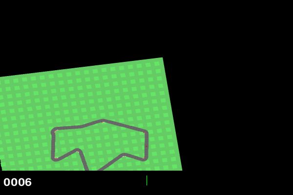
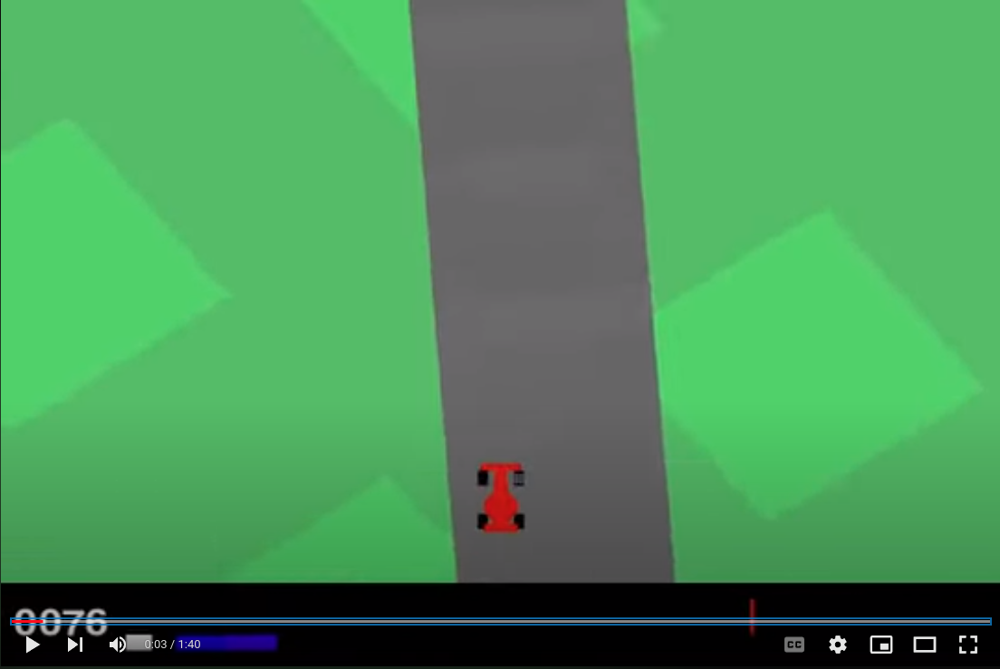

Reinforcement learning (RL) is composed of a set of techniques to train an agent to behave in a manner which would be 
beneficial for the agent to reach towards its goal or keep doing actions to accumulate as much reward as possible.
This type of learning is very intuitive to how us humans learn in which we tend to think and set up our short-term and long-term goals in life and try to do actions which might result in us achieving or getting near our goals.

Because of this intuitive similarity between how humans think and how Reinforcement learning works, it has received 
a lot of interest in Machine Learning research and a lot of varieties of techniques have been proposed for training such
agents. However, the adoption of RL techniques in production is still at a very nascent stage compared to other Machine
Learning paradigms like supervised learning. For RL to become mainstream and be used by (not just tech giants) companies,
it is essential for high-level libraries to exist which make training and developing RL agents faster and easier. 

One such library which we will go through today is Stable Baselines 3 (SB3), which can especially be used to apply RL techniques
on Deep Learning models in a very easy and efficient iterable way. We will also use the Gymnasium (previously Gym)
environment on which virtual agents can be created, trained and tested upon. Thus, we will try to appreciate the ease of
use of the Stable baselines 3 library and make us more competent so that we could perform more complicated experiments further
in RL and pave the way towards making RL more digestible for common business applications.

## Setting up the development environment
1. **Install Gymnasium library** following instructions in their [Github repo](https://github.com/Farama-Foundation/Gymnasium) 
which has access to different pre-defined virtual environments on which RL can be tested upon or, we can create our own environments as well.
2. **Install the Stable Baselines 3 library** using their installation [instructions](https://stable-baselines3.readthedocs.io/en/master/guide/install.html).

It is preferable if you install these dependencies in a separate virtual development environment of your choice like
conda. Although a GPU makes training Deep learning faster but not completely necessary just for learning purpose.

## Check out our virtual environment
In this article, we will use the car racing environment as a follow along example. The details about this environment are
present [here](https://gymnasium.farama.org/environments/box2d/car_racing/). The final trained agent will look like this.

All the environment should have these important
components:
- **Action space:** Refers to what kind of action the agent can do in the env which could be discrete or continuous in nature, 
For example, a car go turn left, turn right, gas or break. For continuous case there will be a continuous range values which these
actions can take, and in discrete these actions will be a pre-defined interval values.
- **Observation space:** Refers to the way the agent will observe the env to then decide on what actions to take. In this
case the observation is in the form of RGB images of 96X96 dimension.
- **Rewards** In RL a reward mechanism have to be specified because the agent's goal is ultimately to maximize the expected return.
The reward specification will directly affect how efficiently and effectively the agent will learn. We need to make a quantitative
reward mechanism by following our subjective intuition of what we want to the agent to achieve. In this case the reward
is set up in such a manner to make the agent learn to drive as fast as possible on the track. The details can be found in the
documentation.
- **Starting state and Episode termination criterion:** Starting state is the agent's foremost beginning state and episode
termination criterion for deciding when to terminate an episode and start a new episode again. Some environments are non-episodic
in nature and can go on indefinitely, but for this simple env we can create episode constraints.

When using an existing gymnasium env, most of these things are pre-defined and we just need to initialize them. Let's do
the same by creating a new python file which can hold a class that defines method on initializing and generating an env.

```
import gymnasium as gym
from stable_baselines3.common.monitor import Monitor


class GymEnv:
    def __init__(self, env_name, env_arguments):
        self.env = None
        self.env_name = env_name
        self.env_arguments = env_arguments

    def create_env(self):
        self.env = gym.make(self.env_name, **self.env_arguments)
        self.env = Monitor(self.env)

    def print_env_info(self):
        if self.env is not None:
            print("The name of Enviornment:", self.env_name)
            print("The action space:", self.env.action_space)
            print("The Observation space:", self.env.observation_space)
            print("The reward range:", self.env.reward_range)
            print("The env spec:", self.env.spec)
            print("The metadata:", self.env.metadata)
        else:
            print("Enviornment is not created yet.")


if __name__ == "__main__":
    env_arguments = {
        'domain_randomize': False,
        'continuous': False,
        'render_mode': 'rgb_array'
    }
    env = GymEnv('CarRacing-v2', env_arguments)
    env.create_env()
    env.print_env_info()
```
Running the file produces the following output:
```
The name of Enviornment: CarRacing-v2
The action space: Discrete(5)
The Observation space: Box(0, 255, (96, 96, 3), uint8)
The reward range: (-inf, inf)
The env spec: EnvSpec(id='CarRacing-v2', entry_point='gymnasium.envs.box2d.car_racing:CarRacing', reward_threshold=900, nondeterministic=False, max_episode_steps=1000, order_enforce=True, autoreset=False, disable_env_checker=False, apply_api_compatibility=False, kwargs={'domain_randomize': False, 'continuous': False, 'render_mode': 'rgb_array'}, namespace=None, name='CarRacing', version=2, additional_wrappers=(WrapperSpec(name='Monitor', entry_point='stable_baselines3.common.monitor:Monitor', kwargs=None),), vector_entry_point=None)
The metadata: {'render_modes': ['human', 'rgb_array', 'state_pixels'], 'render_fps': 50}
```
As you can see in the code, to initialize the car racing env, **all we need is the name of the env, some of its initializing
parameters as per our choosing**: 
- ```domain_randomize```: Whether the color of env should be randomized. In case of False, the color of the surrounding would only
be green and the road would be black.
- ```continuous```: Whether action space to consider is continuous or discrete and
- ```render_mode```: rgb_array represents observation space in rgb pixel values floating point array format

Once the initializing parameters are set, we can just use the ```gym.make``` function to create and use the env. The output
that we see shows some properties of this env like how many discrete actions it has, what is observation space and so on.

## Initializing agent learning parameters
After our environment and agent is set up using the Gym env, we have a skeleton made on what our agent can do, what it will
observe and how env can change because of it. Now, we need to create an algorithm which will help our agent to act more "intelligently".
This is where Stable baselines 3 library can help.

The beauty about SB3 is that many of the popular and established RL algorithms have already been implemented using PyTorch
as a backend framework focusing on ease of ease. So, while initializing an agent, we will concentrate on:
- What kind of algorithm that we want to use like DQN, DDPG, HER, A2C, PPO etc
- Type of feature extractor to use to extract features appropriately so that the agent can observe the environment
productively. For example, a feature extractor for images would look different from a feature extractor for categorical data.
- What kind of Neural network architecture to learn patterns from features extracted
- Hyperparameters like the number of training steps and episodes and algorithm-specific parameters.

Many things like loss function, default Neural Network architecture, basic pre-processing, optimization logic and intricate
algorithmic details are already implemented and can be tweaked if required.

Let's build the functionality of initializing, training, evaluating and visualizing an SB3 Agent class, starting with coding
the agent initialization.

```
class SB3Agent:
    def __init__(self, agent_name: str, agent_algo: str, the_env: GymEnv, model_location: str):
        self.is_trained = False
        self.train_callback = None
        self.model = None
        self.agent_algorithm = agent_algo
        self.agent_policy = None
        self.agent_name = agent_name
        self.model_location = model_location
        self.model_env = the_env

    def create_new_agent(self, policy: str, algorithm_arguments):
        self.agent_policy = policy
        if self.agent_algorithm == 'DQN':
            self.model = DQN(self.agent_policy, self.model_env.env, **algorithm_arguments)
        print("Instantiation of Agent done..")
```
We can see that in the code we're initializing an agent with important inputs like ```agent_algo``` and ```the_env```.
In the ```create_new_agent``` we're instantiating the agent to use DQN (Deep Q Learning) algorithm for training to handle
the "CarRacing-v2" environment using a certain policy which represents the Neural network architecture of feature extractor
and pattern recognizer. SB3 provides three different kinds of policy network by default:
- MlpPolicy: This policy comprises only fully connected layers for both feature extraction and pattern recognition and decision-making 
- CnnPolicy: In this policy, architecture is composed of convolutional neural networks mostly used when images act as observations
- MultiInputPolicy: Suitable when both images and categorical and/or numerical observation together are to be used.

We also have the capability of modifying the individual architectures and even creating a whole custom architecture for
feature extraction and pattern recognition.

## Training the agent
Once the agent has been initialized, the next step is to start training the agent. Most of the training logic is already
built, and only requirement is now calling the ```learn``` method on the initialized agent with appropriate training hyper-parameters
and callbacks if required (to perform some housekeeping tasks while training like saving intermediate models, log metrics and so on).
The code below exemplifies the simplicity of starting the training:
```
    def train_agent(self, train_arguments, callbacks: [List[BaseCallback]] = None):
        self.train_callback = callbacks
        self.model.learn(**train_arguments, callback=self.train_callback)
        self.is_trained = True
        print("Training complete..")
```

## Saving and loading an agent
Saving and loading a trained agent should be as easy as possible. Since SB3 is based on PyTorch, saving and loading of agents work
very similar to PyTorch saving and loading. Saving an agent can mean saving the neural network model parameters which can then be loaded whenever required. 
It can also mean saving the state of agent training so that it could be resumed. SB3 uses pickling by default to save the agent.
As seen below, saving and loading is as simple as calling save and load methods.
```
    def save_trained_agent(self, name: str):
        path = os.path.join(self.model_location, name)
        self.model.save(path)
        print("model saved in location:", path)
        
    def load_a_trained_agent(self):
        if self.agent_algorithm == 'DQN':
            self.model = DQN.load(self.model_location, self.model_env.env)
        self.is_trained = True
        print("Loading model complete..")
```

## Visualize how our agent works
After training and even during training, it is helpful to actually be able to visualize how our agent is working in the
environment. This is also referred to as rendering the environment in real time while the agent is performing.
The logic of how the environment is rendered is present in the Gym env and can be integrated seamlessly with the SB3 agent
that has/is being trained.

The methods ``enjoy_trained_agent`` and ``record_agent`` adds functionality to see the working of agent after it is loaded,
and recording the working of agent as a video.

```
    def enjoy_trained_agent(self, num_steps=1000):
        vec_env = DummyVecEnv([lambda: self.model_env.env])
        obs = vec_env.reset()
        for i in range(num_steps):
            action, _ = self.model.predict(obs, deterministic=True)
            obs, rewards, dones, info = vec_env.step(action)
            vec_env.render(mode='human')

    def record_agent(self, record_location: str, video_length: int, name_prefix: str):
        # It requires ffmpeg or avconv to be installed on the machine
        vec_env = DummyVecEnv([lambda: self.model_env.env])
        vec_env = VecVideoRecorder(vec_env, record_location,
                                   record_video_trigger=lambda x: x == 0, video_length=video_length,
                                   name_prefix=name_prefix)
        obs = vec_env.reset()
        for _ in range(video_length + 1):
            action, _ = self.model.predict(obs, deterministic=True)
            obs, _, _, _ = vec_env.step(action)
        vec_env.close()
```
In the methods above ``DummyVecEnv`` is a helper function provided by SB3 which can vectorize the environment so that
observing the env can become parallel and thus faster. In the ``enjoy_trained_agent`` method these things are happening:
1. The environment is converted into a vector environment for efficient processing
2. The env is reset to collect the very first observation
3. Trained model is used to predict what actions to take depending on the observation from the env.
4. The action that was decided to take is taken using the ``step`` function of the env
5. The env is rendered so that we can visualize it.
6. Steps 3 to 5 are repeated until the max number of steps that we want to see the agent in action.

Similar logic is applied for recording the video, but using utility function ``VecVideoRecorder`` provided by SB3.
You can see how this agent is working when trained using DQN for 1 million steps in this recorded video below:
[](https://youtu.be/I8l90e4Ehh4)

## Evaluating the agent
In Reinforcement learning, evaluating the performance of agents generally refers to calculating on average how much reward
the agent is able to acquire over a set period of time. The more the reward, the better the agent. Because of more uncertainty
in RL problems compared to supervised learning problems (where the exact correct answer is available as opposed to taking action which
might not have to be optimal everytime), it is a good practice for evaluating the model using different seeds, and random states as possible
to check the agent's robustness.

SB3 also provides a basic helper function ``evaluate_policy`` to evaluate a trained model on existing algorithms.
```
    def evaluate_agent(self, eval_episodes=20, callback=None, evaluate_args={}):
        mean_reward, std_reward = evaluate_policy(self.model, self.model_env.env, n_eval_episodes=eval_episodes,
                                                  callback=callback, **evaluate_args)
        print(f"The mean_reward across {eval_episodes}: {mean_reward}")
        print(f"The std_reward across {eval_episodes}: {std_reward}")
```

## Extending and experimenting
**We can try to improve the performance agent in the following ways:** 
- Hyperparameter tuning: Training RL based agents have been found to be very susceptible to hyperparameters. Changing the hyperparameters to good
values can result in drastic improvements. So, Hyperparameter tuning in RL problems is even more important to get good
results compared to supervised machine learning.
- Sometimes the default architectures provided for simplicity in SB3 aren't suitable for harder environments, and thus
more complex custom architectures can be built and integrated.
- Reinforcement learning, especially model-free RL can be highly sample inefficient, so in many cases, training for a longer period
of time can be the answer to improvement of the agent.

## Conclusion
In this article, we saw how Stable baselines3 can make our lives easier to test out complex Reinforcement algorithms
on environments and agents created using Gym interface. It would be interesting to test out working of SB3 on more complex
environments or even custom-made environments using and comparing performance of different algorithms.
