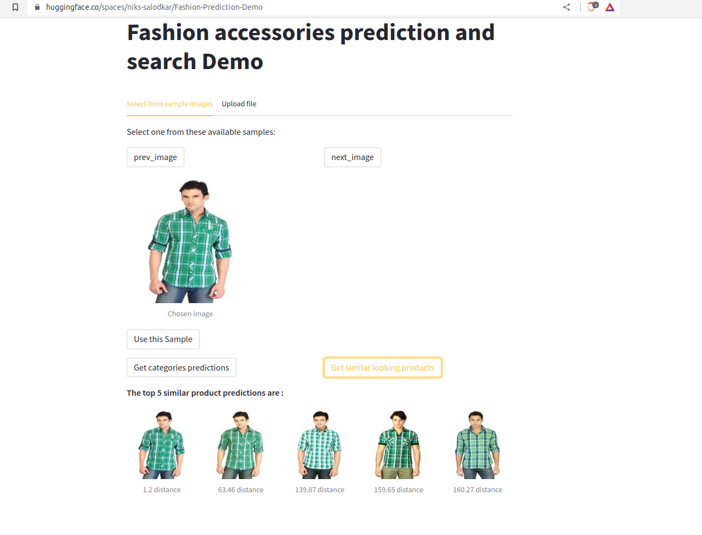

### Objective
Create and train a classification model using Convolutional Nerual Network architectures like ResNet to 
classify images into different product categories and subcategories and use the trained Neural Network to 
generate images embeddings which could help in creating a simple visual similarity recommendation system.

### Code
Github Link: [https://github.com/nikhil-salodkar/fashion_detection](https://github.com/nikhil-salodkar/fashion_detection)

### Demo
Live Demo can be tried in Huggingface spaces: [https://huggingface.co/spaces/niks-salodkar/Fashion-Prediction-Demo](https://huggingface.co/spaces/niks-salodkar/Fashion-Prediction-Demo)

### Dataset
The Kaggle dataset can be found [here](https://www.kaggle.com/datasets/paramaggarwal/fashion-product-images-dataset).