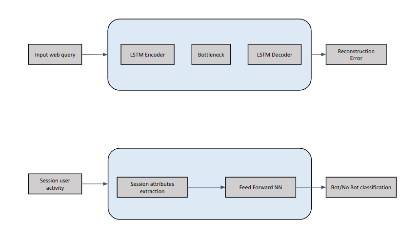

### Objective
An Entertainment retail company wants to develop a Machine learning system to detect, analyze, prevent web traffic of malicious and/or automated bots

### Data Requirements
The client has access to millions of rows of web requests arising to its website with detailed information on:
- Get requests URL and header information, 
- Time of requests, 
- Cookie and session information
- Form submission queries

### Evaluation metrics and success criterion
**SLA**
1. More than 90% recall and precision to detect malicious requests
2. More than 85% recall and precision to automatically detect bots

**Success criteria**: Accurately predicting malicious queries and bots automatically saves how much manual time of Cybersecurity Engineers

### Solution and Deliverables summary
The Machine learning solutions comprised of several models, components and deliverables:
1. Data pre-processing and Cleaning the web requests to extact relevant information
2. Developing a character level sequence model to detect anomalous web request that could be malicious and contains commands for SQL injection and Cross site scripting
3. Developing an anomaliy detection statistical model to predict anomalous activity of a user session
4. Development of web dashboard so that clients can view the prediction results in real time and analyze its performance

### Major technologies and tools used
1. LSTM, CNN, Encoder Decoder models
2. PyTorch, Sklearn, NLTK, Plotly
3. Node.js