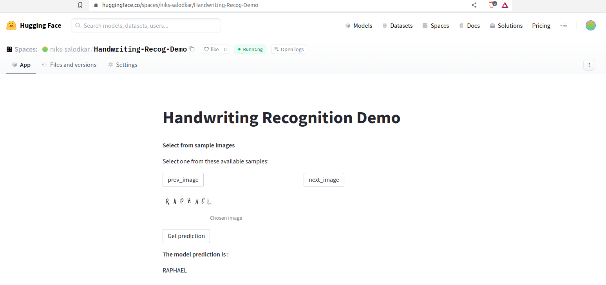

### Objective
Experiment with developing and training a Handwriting recognition model using Convolutional Neural Network 
and sequential model like LSTM together which could predict what is written in an image by first extracting 
its image features and feeding the image features to a sequential model to further make prediction of character sequences.

### Code
Github Link : [https://github.com/nikhil-salodkar/handwriting_recognition](https://github.com/nikhil-salodkar/handwriting_recognition)

### Demo
Live Demo can be tried in Huggingface spaces : [https://huggingface.co/spaces/niks-salodkar/Handwriting-Recog-Demo](https://huggingface.co/spaces/niks-salodkar/Handwriting-Recog-Demo)

### Dataset
The Kaggle dataset can be found [here](https://www.kaggle.com/datasets/landlord/handwriting-recognition).