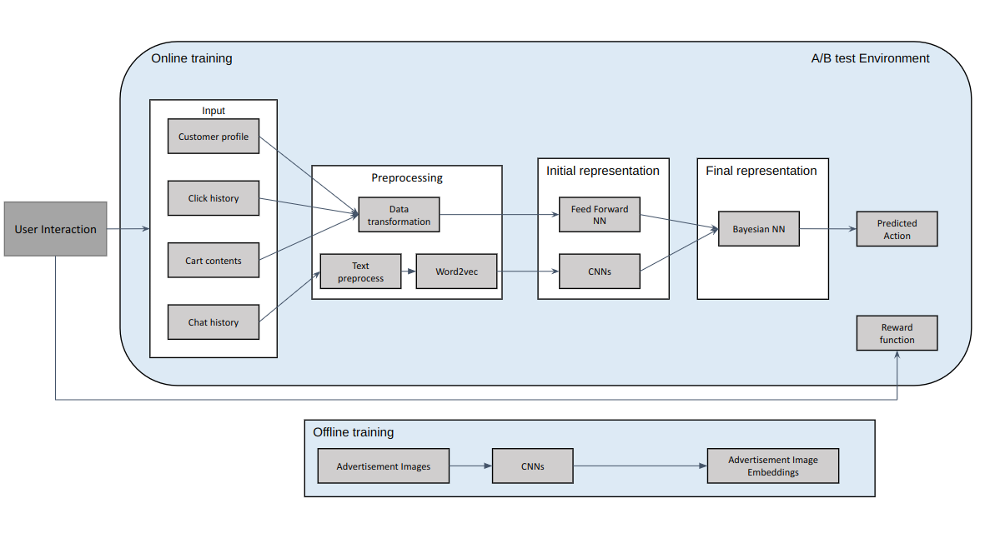

### Objective
A reputed Entertainment Resort company wants to increase engagement to their website hoping to increase their ticket sales by showing customers relevant attractions

### Data Requirements
Each customer can have personalized information including:
- Profile info : Signedup customers have information regarding their name, place of origin, family information, interests presented in categorical and textual format
- Clickstream info: History of clicks and page visits of the logged in or not loggedin customer
- Interaction info: Interactions and queries made by customers through chat and forums in textual format
- Cart info: Interactions and services added to cart so far by the client

### Evaluation metrics and success criterion
1. Click-through rate
2. Cart conversions and sales
3. Email advertisement engagement

Success criterion: Statistically significant increase in evaluation metrics by at least 10%

### Solution and Deliverables summary
The Machine learning solutions comprised of several models, components and deliverables:
1. Support the client and Data Engineers in building A/B test platform to test out this project
2. Support with developing data pre-processing and cleaning pipeline
3. Build Multi-model architecture to convert customer information types into embeddings which could be used together for analysis and prediction
4. Develop a Neural Network based Contextual Multi-armed Bandit model to leverage the customer information and produce relevent recommendation
5. Support the client on decision regarding what type of images and text would be useful to show as recommendations
6. Integrate the models developed in the A/B testing pipeline

### Major technologies and tools used
1. Bayesian Neural Networks for Contextual Multi-armed bandits
2. CNN, Word2vec, Feed forward Neural Networks, A/B testing
3. Tensorflow, Tensorflow Serving