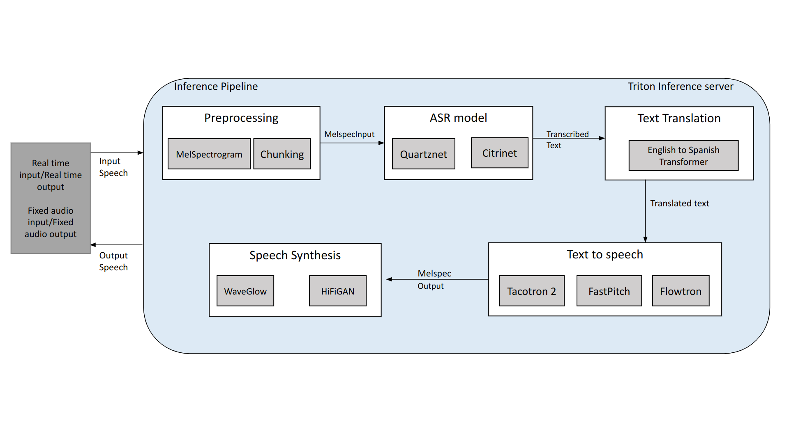

### Objective
A client in entertainment and News industry wanted to build in a Proof of Concept an end-to-end inference 
pipeline which could perform speech to text, text translation, and text to speech in real time so that it 
could be a precursor to a full production pipeline having further trained models for required languages 
deployed on edge devices.

### POC Requirements
1. Experiment with pre-trained ASR model performance and efficiency for English language on sports and non-sports news
2. Experiment with performance of existing text translation model for English to Spanish
3. Experiment with performance of pre-trained text to speech model for English
4. Experiment on how to efficiently deploy this multimodel architecture and assess its real time efficiency concerns
5. Build a demo showcasing the capabilities on downloaded and provided News videos in real time

### Solution and Deliverables summary
The Machine Learning solution comprised of several models, components and deliverables :

1. Developing individual inference scripts to perform Automatic speech recognition, text translation and text to speech in real time
2. Developing evaluation metrics for individual components and for integrated pipeline
3. Experiment with pretrained ASR models including Quartznet and Citrinet, Text translation using Transformer based model and Text to speech using Techotron 2 and Nvidia's Fastpitch and Flowtron
4. Developing Multi-model ensemble pipeline using Triton Inference Server

### Major technologies and tools used
1. Pre-trained ASR, Translation and TTS models
2. PyTorch, Triton Inference Server
3. Node.js