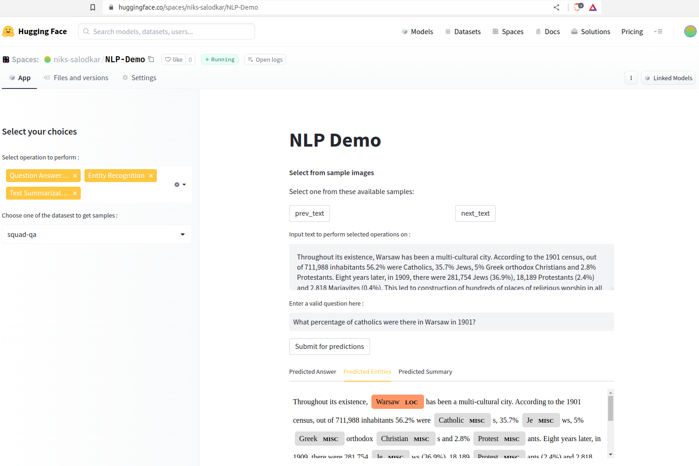

### Objective
 To experiment with solving different NLP tasks including Extractive Question Answering, Summarization, 
 Named Entity Recognition using pre-trained transformer models of different types including only 
 Encoder model like Roberta and both Encoder and Decoder autoregressive models like Roberta2Roberta for 
 summarization.

### Code and Demo
Live Demo can be tried in Huggingface spaces: [https://huggingface.co/spaces/niks-salodkar/NLP-Demo](https://huggingface.co/spaces/niks-salodkar/NLP-Demo)