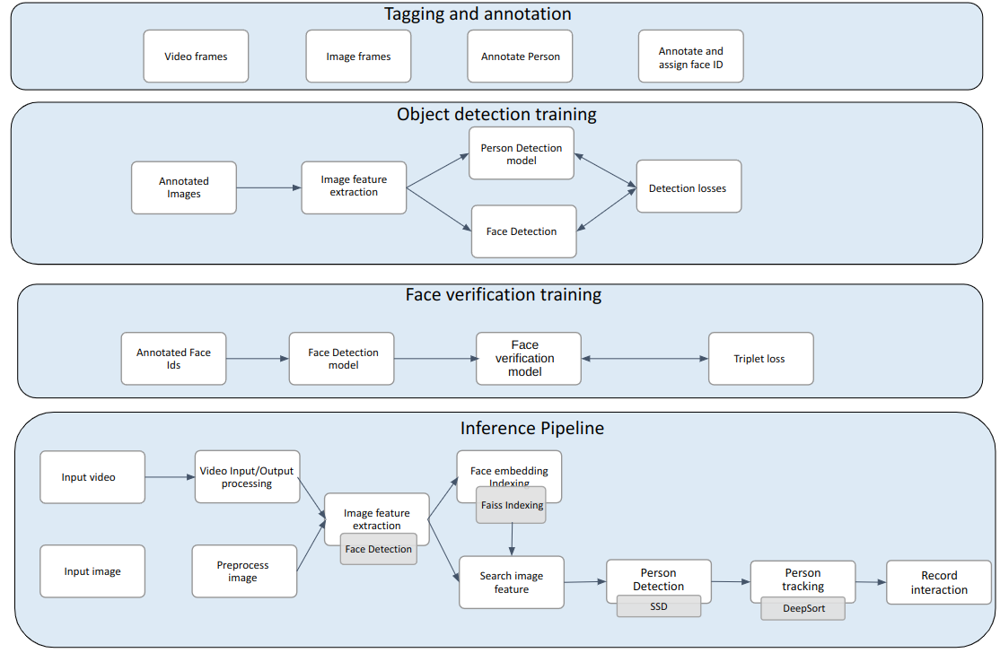

### Objective
A client in Security surveillance industry wants to create a customized solution to search for people and track their movement in surveillance video

### Data Requirements
The client had access to thousands of hours of video data containing front facing video of people with visible faces

### Evaluation metrics and success criterion
**SLA**
1. More than 99% recall of person identification
2. More than 80% precision of person identification
3. More than 0.4 Intersection over union for person detection

**Success criteria**: Accurately predicting malicious queries and bots automatically saves how much manual time of Cybersecurity Engineers

### Solution and Deliverables summary
Some Machine learning models and techniques used are:
1. Accumulation of image data from video frames to train custom face verification model
2. Tagging images with timestamps for curating person detection and tracking dataset
3. Fine-tuning face detection model, Training custom face verification model, Fine-tuning pre-trained person detection model, Training person tracking model
4. Person Identification algorithm generation
5. Developing dashboard to visualize the prediction results of model pipeline

### Major technologies and tools used
1. CNN, SSD Object detection, DeepSort tracking
2. Tensorflow Keras, Tensorflow Serving
3. Node.js