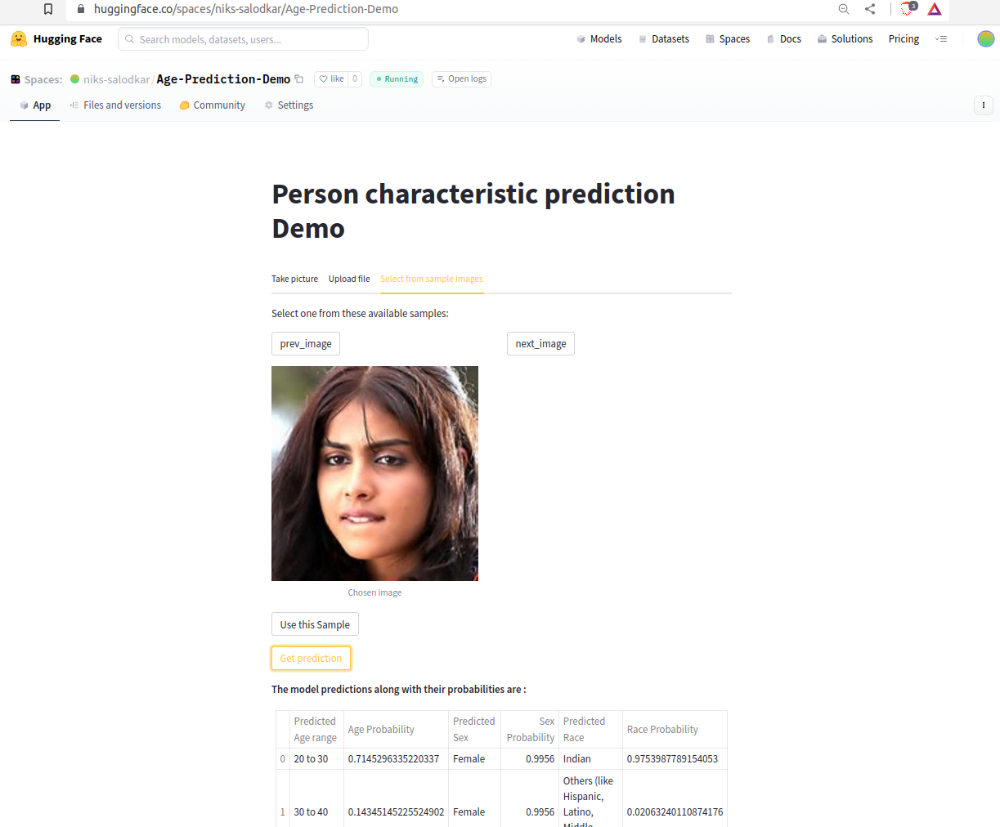

### Objective
Experiment with development, training and hyperparameter tuning of multitask, multiclass classification model to 
classify attributes including sex, race, and age group.

### Code
Github Link: [https://github.com/nikhil-salodkar/age_prediction](https://github.com/nikhil-salodkar/age_prediction)

### Demo
Live Demo can be tried in Huggingface spaces: [https://huggingface.co/spaces/niks-salodkar/Age-Prediction-Demo](https://huggingface.co/spaces/niks-salodkar/Age-Prediction-Demo)

### Dataset
UTKFace dataset used for training the model which can be found [here](https://susanqq.github.io/UTKFace/).