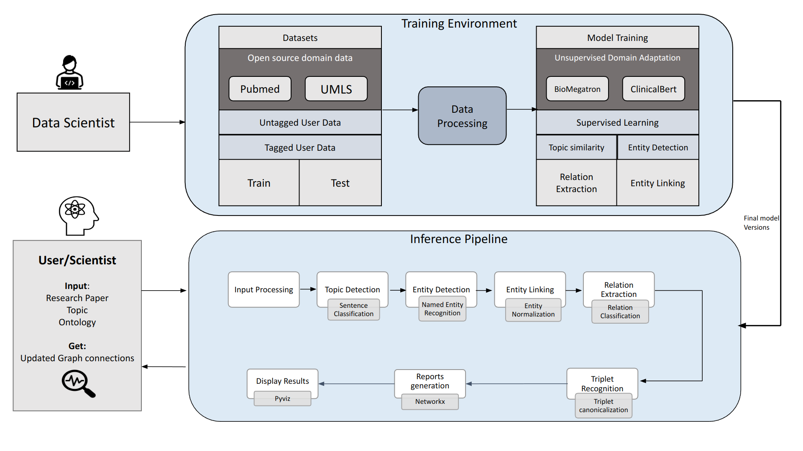

### Objective
The Pharma client is in need of an automated system to Detect, Disambiguate and Link technical entities and relations 
from published research literature to existing ontology which could help the scientists expedite their Drug Discovery 
research.

### Problem Requirements
Given research text as input:
1. Detect clinical entities of interest from sentences
2. Link and Disambiguate detected entities to existing ontologies
3. Detect relation between entities if present
4. Form entity -> relation -> entity triplet which could be fed into a database for further analysis

### Solution and Deliverables summary
The Machine Learning solution comprised of several models, components and deliverables :

1. Fine-tuned BioMegatron Language model to perform named entity recognition to detect entity classes including Drug names, Proteins and Genes using client provided annotated text data
2. Trained a topic similarity model using contrasitive learning techniques to detect paragraph relevance to predefined topics of interest
3. Fine-tuned BioMegatron model to detect relation between entities of interest
4. Develop pipeline for automated and human evaluation to get metrics like top k recall, precision, exact match, and visual inspection of results
5. Create separate training and inference dockerized environment
6. Develop web based demo application to view results and acquire human feedback