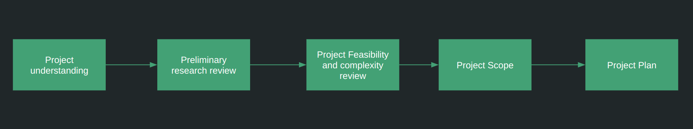

### AI/ML Project startup and Requirement Analysis consultation
**Thinking of starting a new project for solving your business requirements leveraging Artificial Intelligence and Machine Learning
techniques?** This can be a very daunting process especially if you don't have experience with managing prior 
AI projects. Many important questions needs to be answered and things to be clarified, such as:
- Understanding your business idea and articulating it properly from technical perspective
- Assessing the feasibility of the development and success of the project
  - How complex from development perspective the problem is?
  - What type of data is needed? How much data is needed? Do I have the needed data?
  - What kind of team structure would be required to solve this problem
  - Is a small POC needed before jumping into large scale project development?
  - What kind of prototypes if required should be built first?
  - Time requirement to develop the solutions?
  - Budget requirements?
- Reviewing how novel your business problem is? Researching how other businesses have solved similar problems
- Finally, creating a project plan depending on the team structure and time deadline.

If these questions are not answered and project is started pre-maturely, the probability of failure of the
project and difficulty in delivering increases dramatically.

Having extensive experience in developing, architecting and planning Machine learning projects I can be your
consultant helping to make the first steps correctly so that your project delivery journey is smoother
and in correct direction.
I can provide consultation in any and all steps as mentioned below:

- **Project understanding:** Understanding the business requirements thoroughly, converting business problem statement
to technical problem statement, Explaining the data requirements, laying out the initial steps to start the project
- **Preliminary research review:** Research existing similar problems solved in scientific literature, Finding current
SOTA approaches which could be utilized, Document various solution strategies and options
- **Project Feasibility and complexity review:** Based on preliminary research assess project complexity in terms of
  - Complexity of data requirement (How much data required, what type of data required, Availability of data)
  - Complexity of implementation (How novel the solution approaches are, How much implementation is required
  what type of Libraries/Framework/Languages and expertise would be required)
  - Time requirement and Budget estimates: Estimate approximate time and budget requirements
- **Project Scope:** Deciding whether a POC is required, what kind of prototypes should be developed, what should be
the scope of further experiments and project milestones
- **Project planning:** Layout the team structure, Build spring plan, Document milestones in detail, Outline tasks
and subtasks etc.