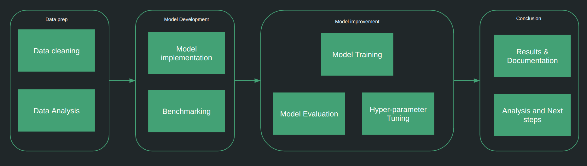

### Implementing Proof of Concepts and building prototypes
**In many cases, a proof of concept is required before undertaking a larger project with bigger teams and
larger budgets so that you could be more confident on feasibility of a project and idea.**

In this regard, I can help with
1. Data preparation, cleaning and Exploratory data analysis
2. Custom deep learning model training and hyperparameter tuning
3. Evaluating and comparing performance metrics of trained models
4. Support for Deep Learning research paper implementations

My 6+ years of development experience in AI and ML would be invaluable.

#### Tech stack and services that I work with:
1. **Deep Learning** : PyTorch, PyTorch Lightning, Huggingface Library, Weights and Biases, TorchMetrics, TorchVision, TorchScript, TorchServe 
2. **Traditional Machine Learning** : Scikit-learn, SciPy, Statsmodels 
3. **Languages** : Python 3.x and above 
4. **Data processing and Visualization** : Pandas, Numpy, Plotly, Matplotlib, Spacy, Gensim, Nvidia RAPIDS
5. **Others**: Streamlit, FastAPI, Kubernetes, Google Cloud Platform, AWS