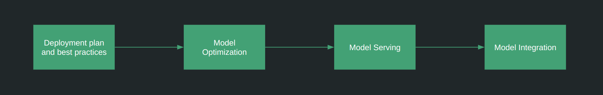

### Taking to production

**Have a POC already done? Prototype models build? Need support in improving and putting your work in production?
I can definitely be of help in following ways:**
1. Guidance in building solution architecture for your production environment
2. Help with deploying scalable Model serving environment either in cloud or edge
3. Support with integrating newly built ML services in your existing application